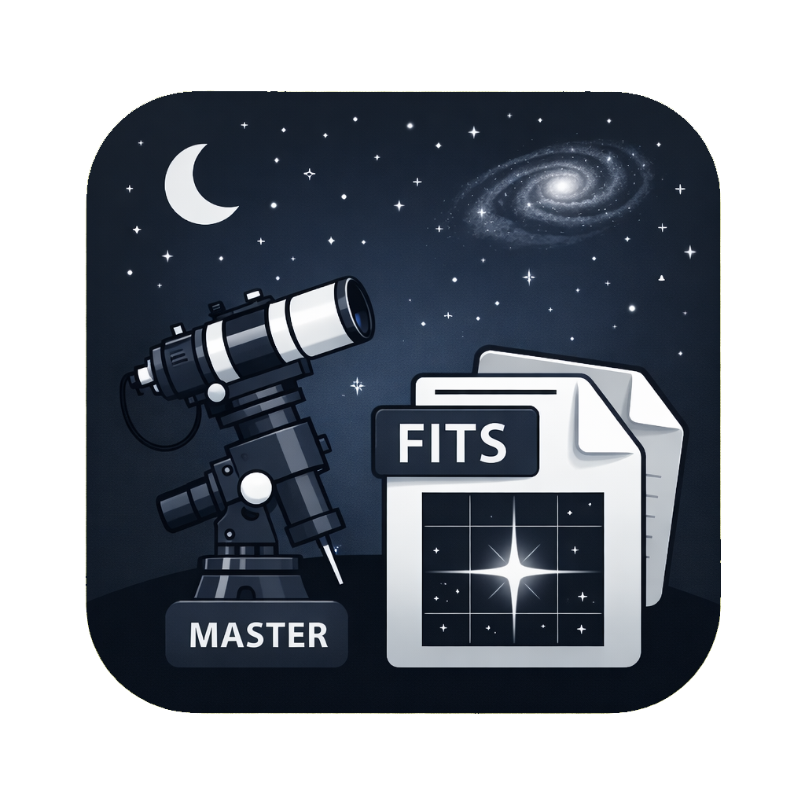

<p align="center">
  
</p>

<h1 align="center">Astro Session Manager</h1>

<p align="center">
  A desktop app for managing astrophotography imaging sessions and masters library.<br/>
  Built with Tauri 2, Rust, React, and TypeScript.
</p>

---

## Features

- **Session overview** — see total integration time, subframe count, and gallery size at a glance for every project and filter
- **Masters library** — browse and manage your dark, bias, and flat master frames with automatic calibration matching by temperature, exposure, and resolution
- **Filesystem-based** — simple cached database, no lock-in. Works with a simple structured folder tree (`project/filter/date/lights/`) that you fully control
- **Project scaffolding** — quickly create new project folders with the unified directory structure
- **FITS/XISF header parsing** — reads CCD temperature, exposure time, gain, resolution, and more directly from your files
- **Image previews** — generates and caches thumbnails for quick visual browsing
- **Cross-platform** — runs on macOS, Windows, and Linux

## Folder Structure

The app expects your astrophotography data to follow this directory layout:

```
root_folder/
├── ic1805/
│   ├── ha/
│   │   ├── night 1/
│   │   │   ├── lights/
│   │   │   │   ├── ic1805_ha_300s_001.fits
│   │   │   │   ├── ic1805_ha_300s_002.fits
│   │   │   │   └── ...
│   │   │   └── flats/
│   │   │       └── flat_ha_001.fits
│   │   └── night 2/
│   │       └── lights/
│   │           └── ...
│   ├── oiii/
│   │   └── night 1/
│   │       └── lights/
│   │           └── ...
│   └── sii/
│       └── ...
├── m42/
│   └── dualband/
│       └── night 2/
│           └── lights/
│               └── ...
└── masters/
    ├── darks/
    │   └── MasterDark_300s_-10C.fits
    └── biases/
        └── MasterBias_-10C.fits
```

Each level maps to: **Project → Filter → Night → Subframes (lights/flats)**

## Contributing

Pull requests and issues are welcome! If you have ideas, bug reports, or feature requests, feel free to [open an issue](../../issues) or submit a PR.

## Development

### Prerequisites

- [Node.js](https://nodejs.org/) (v24+)
- [Yarn](https://yarnpkg.com/)
- [Rust](https://www.rust-lang.org/tools/install)

### Getting started

```bash
# Install dependencies
yarn

# Run in development mode
yarn tauri dev
```

### Building

```bash
yarn tauri build
```

Builds for the current platform. Cross-platform builds are handled via GitHub Actions CI.

## License

[GNU General Public License](LICENSE)
